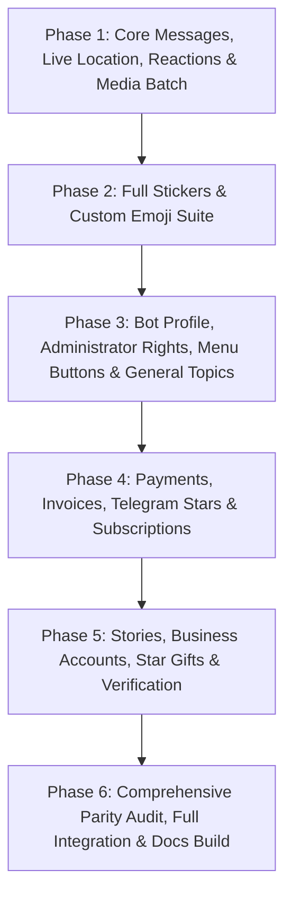

# 🗺️ Master Plan: 100% Upstream API & Types Parity Migration

> Comprehensive architectural roadmap for porting all remaining Telegram Bot API methods, data models, stickers, payments, stories, business features, and filters from upstream into `tele-bot`.

---

## 📊 Overview & Migration Scope

- **Total Upstream Bot API Methods**: 196 methods
- **Currently Implemented**: 66 methods
- **Remaining to Port**: 130 methods
- **Upstream Data Models & Types**: ~150 data schemas across `src/telegram/_*.py`
- **Zero-Dependency Mandate**: 100% native Node.js 22+ built-ins (`fetch`, `node:sqlite`, `node:http`, `node:crypto`).
- **Strict Quality Gates**:
  1. `npm run build` -> 0 TypeScript compilation errors (`strict: true`, `noUncheckedIndexedAccess: true`).
  2. `npm test` -> 100% unit tests pass with deterministic mock HTTP adapter.
  3. `npm run test:coverage` -> >90% line coverage.
  4. `npm run docs` -> 0 TypeDoc errors, 0 warnings.
  5. 0 mentions of Python or migration in public code/comments/docs.

---

## 🗓️ Phase Breakdown & Delegation Structure

---

### 🔹 Phase 1: Batch Messages, Live Location, Reactions & Media
- **Target Files**:
  - `src/client/types.ts`: Define `ReactionType`, `ReactionCount`, `InputMedia*`, `LiveLocationOptions`, `MessageReactionUpdated`.
  - `src/client/bot.ts`: Implement:
    - `deleteMessages(chat_id, message_ids)`
    - `forwardMessages(options)`
    - `copyMessages(options)`
    - `editMessageMedia(options)`
    - `editMessageLiveLocation(options)`
    - `stopMessageLiveLocation(options)`
    - `stopPoll(chat_id, message_id, options)`
    - `setMessageReaction(options)`
    - `deleteMessageReaction(options)`
    - `deleteAllMessageReactions(chat_id, message_id)`
  - `tests/unit/client/bot.test.ts`: Exhaustive mock tests for all 10 methods.

---

### 🔹 Phase 2: Stickers & Custom Emoji Suite
- **Target Files**:
  - `src/client/types.ts`: Define `Sticker`, `StickerSet`, `MaskPosition`, `InputSticker`, `CustomEmojiStickers`.
  - `src/client/bot.ts`: Implement:
    - `sendSticker`, `getStickerSet`, `getCustomEmojiStickers`, `uploadStickerFile`
    - `addStickerToSet`, `setStickerPositionInSet`, `createNewStickerSet`
    - `deleteStickerFromSet`, `deleteStickerSet`, `replaceStickerInSet`
    - `setStickerSetThumbnail`, `setStickerSetTitle`, `setStickerEmojiList`, `setStickerKeywords`, `setStickerMaskPosition`, `setCustomEmojiStickerSetThumbnail`
  - `tests/unit/client/bot.test.ts`: Complete test coverage for sticker workflows.

---

### 🔹 Phase 3: Bot Identity, Admin Rights & Forum Supergroups
- **Target Files**:
  - `src/client/types.ts`: Define `BotCommandScope`, `BotDescription`, `BotShortDescription`, `BotName`, `ChatAdministratorRights`, `MenuButton`, `ForumTopic`.
  - `src/client/bot.ts`: Implement:
    - `setMyName`, `getMyName`, `setMyDescription`, `getMyDescription`, `setMyShortDescription`, `getMyShortDescription`
    - `setMyDefaultAdministratorRights`, `getMyDefaultAdministratorRights`
    - `setChatMenuButton`, `getChatMenuButton`
    - `editGeneralForumTopic`, `closeGeneralForumTopic`, `reopenGeneralForumTopic`, `hideGeneralForumTopic`, `unhideGeneralForumTopic`, `unpinAllForumTopicMessages`, `unpinAllGeneralForumTopicMessages`
    - `banChatSenderChat`, `unbanChatSenderChat`
  - `tests/unit/client/bot.test.ts`: Test identity updates and forum topic controls.

---

### 🔹 Phase 4: Payments, Telegram Stars & Invoices
- **Target Files**:
  - `src/client/types.ts`: Define `LabeledPrice`, `Invoice`, `ShippingAddress`, `OrderInfo`, `ShippingOption`, `SuccessfulPayment`, `PreCheckoutQuery`, `ShippingQuery`, `StarTransaction`, `StarTransactions`.
  - `src/client/bot.ts`: Implement:
    - `sendInvoice`, `createInvoiceLink`
    - `answerShippingQuery`, `answerPreCheckoutQuery`
    - `refundStarPayment`, `getStarTransactions`, `editUserStarSubscription`, `getMyStarBalance`
  - `tests/unit/client/bot.test.ts`: Test payment workflows and star transactions.

---

### 🔹 Phase 5: Telegram Stories, Business & Star Gifts (Telegram 8.0+)
- **Target Files**:
  - `src/client/types.ts`: Define `Story`, `BusinessConnection`, `BusinessMessagesDeleted`, `Gift`, `Gifts`, `UserChatBoosts`.
  - `src/client/bot.ts`: Implement:
    - `postStory`, `editStory`, `deleteStory`, `repostStory`
    - `getBusinessConnection`, `readBusinessMessage`, `deleteBusinessMessages`
    - `getAvailableGifts`, `sendGift`, `getUserGifts`, `getChatGifts`, `convertGiftToStars`, `upgradeGift`, `transferGift`, `transferBusinessAccountStars`
    - `verifyChat`, `verifyUser`, `removeChatVerification`, `removeUserVerification`
    - `getUserChatBoosts`, `setUserEmojiStatus`
  - `tests/unit/client/bot.test.ts`: Test story, business, and gift APIs.

---

### 🔹 Phase 6: Final Verification, Parity Diff Check & Quality Gates
- Execute automated parity comparison script against upstream `_bot.py`.
- Run full quality checks:
  1. `npm run build`
  2. `npm run test:coverage` (>90% lines across all modules)
  3. `npm run docs` (0 errors, 0 warnings)
  4. Update README and export barrels.

