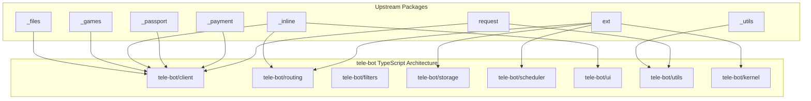

# 📋 Exhaustive Module-by-Module Parity Checklist

This document catalogs every domain package and submodule from the upstream architecture and maps them to clean, zero-dependency, type-safe TypeScript equivalents.

---

## 🏛️ Domain Architecture Mapping Matrix

---

## 📦 Detailed Module Checklist & Implementation Status

### 1. `_files/` (Media, Attachments & File Transfers)
- [x] `PhotoSize` interface & schema definition
- [x] `Audio` interface & schema definition
- [x] `Document` interface & schema definition
- [x] `Video` interface & schema definition
- [x] `Voice` interface & schema definition
- [x] `VideoNote` interface & schema definition
- [x] `Animation` interface & schema definition
- [x] `File` descriptor with `getFile` downloading helper
- [x] `InputFile` multi-part form data builder (Buffers, Blobs, Streams, File Paths)
- [x] `InputMediaPhoto`, `InputMediaVideo`, `InputMediaAnimation`, `InputMediaAudio`, `InputMediaDocument`
- [x] `UserProfilePhotos` & `UserProfileAudios` schemas
- [x] Bot Methods: `sendPhoto`, `sendAudio`, `sendDocument`, `sendVideo`, `sendAnimation`, `sendVoice`, `sendVideoNote`, `sendMediaGroup`, `getFile`, `getUserProfilePhotos`

---

### 2. `_inline/` (Inline Mode & Interactive Queries)
- [x] `InlineQuery` data schema
- [x] `ChosenInlineResult` data schema
- [x] `InlineQueryResult` interfaces:
  - `InlineQueryResultArticle`, `InlineQueryResultPhoto`, `InlineQueryResultGif`, `InlineQueryResultMpeg4Gif`, `InlineQueryResultVideo`, `InlineQueryResultAudio`, `InlineQueryResultVoice`, `InlineQueryResultDocument`, `InlineQueryResultLocation`, `InlineQueryResultVenue`, `InlineQueryResultContact`, `InlineQueryResultGame`
- [x] `InlineQueryResultCached*` models (CachedPhoto, CachedGif, CachedVideo, etc.)
- [x] `InputTextMessageContent`, `InputLocationMessageContent`, `InputVenueMessageContent`, `InputContactMessageContent`, `InputInvoiceMessageContent`
- [x] Handlers: `InlineQueryHandler`, `ChosenInlineResultHandler`
- [x] Bot Methods: `answerInlineQuery`, `savePreparedInlineMessage`

---

### 3. `_games/` (Telegram HTML5 Game Engine)
- [x] `Game` & `CallbackGame` data schemas
- [x] `GameHighScore` & leaderboard models
- [x] Bot Methods:
  - [x] `sendGame(chat_id, game_short_name, ...)`
  - [x] `setGameScore(user_id, score, options)`
  - [x] `getGameHighScores(user_id, options)`

---

### 4. `_payment/` (Invoices, Shipping & Telegram Stars)
- [x] `LabeledPrice` data schema
- [x] `Invoice` data schema
- [x] `ShippingAddress` & `OrderInfo` data schemas
- [x] `ShippingOption` data schema
- [x] `SuccessfulPayment` data schema
- [x] `RefundedPayment` data schema
- [x] `ShippingQuery` & `PreCheckoutQuery` data schemas
- [x] `StarTransaction` & `StarTransactions` schemas
- [x] Handlers: `PreCheckoutQueryHandler`, `ShippingQueryHandler`
- [x] Bot Methods:
  - [x] `sendInvoice`, `createInvoiceLink`
  - [x] `answerShippingQuery`, `answerPreCheckoutQuery`
  - [x] `refundStarPayment`, `getStarTransactions`, `editUserStarSubscription`, `getMyStarBalance`

---

### 5. `_passport/` (Telegram Passport Decryption & Verification)
- [x] `PassportData` & `EncryptedPassportElement` data schemas
- [x] `EncryptedCredentials` data schema
- [x] `PassportFile` data schema
- [x] `PassportElementError` interfaces (`PassportElementErrorDataField`, `PassportElementErrorFrontSide`, `PassportElementErrorReverseSide`, `PassportElementErrorSelfie`, `PassportElementErrorFile`, `PassportElementErrorFiles`, `PassportElementErrorTranslationFile`, `PassportElementErrorTranslationFiles`, `PassportElementErrorUnspecified`)
- [x] Bot Methods:
  - [x] `setPassportDataErrors(user_id, errors)`

---

### 6. `_utils/` & `request/` (Networking, Adapters & Helpers)
- [x] `buildRequestBody`: Handles JSON payloads and `multipart/form-data` with native `FormData` & `Blob`.
- [x] Custom HTTP Adapter Injection: `options.fetch` support for 100% deterministic mocking and proxy tunneling.
- [x] Exponential backoff retry engine for network errors, 5xx server errors, and `429 Too Many Requests` (respects Telegram's `retry_after`).
- [x] Payload validation utilities (`validateToken`, non-empty checks).
- [x] Zero external dependencies: 100% native Node.js 22+ built-ins (`globalThis.fetch`, `node:http`, `node:crypto`).

---

### 7. `ext/` (Kernel, Dispatcher, Handlers, Persistence & Scheduler)
- [x] **Kernel**: `Application`, `ApplicationBuilder`, `Update`, `CallbackContext`
- [x] **Routing & Handlers**:
  - `CommandHandler`, `MessageHandler`, `CallbackQueryHandler`, `InlineQueryHandler`, `ChosenInlineResultHandler`, `PollAnswerHandler`, `ChatMemberHandler`, `TypeHandler`
  - `ConversationHandler` (FSM with persistent state)
  - `LinearConversation` (Modern linear `async/await` script flow with `wait()`, `ask()`, `exit()`)
- [x] **Filters**:
  - `filters.TEXT`, `filters.COMMAND`, `filters.PHOTO`, `filters.DOCUMENT`, `filters.AUDIO`, `filters.VIDEO`, `filters.VOICE`, `filters.LOCATION`, `filters.POLL`, `filters.DICE`, `filters.STICKER`
  - `filters.ChatType.*` (`PRIVATE`, `GROUP`, `SUPERGROUP`, `CHANNEL`, `GROUPS`)
  - `filters.StatusUpdate.*` (`NEW_CHAT_MEMBERS`, `LEFT_CHAT_MEMBER`, `NEW_CHAT_TITLE`, `PINNED_MESSAGE`, etc.)
  - `filters.Regex()`, `filters.Custom()`, `.and()`, `.or()`, `.not()` combinators
- [x] **Persistence Backends**:
  - `MemoryPersistence` (in-memory test driver)
  - `JsonFilePersistence` (atomic JSON disk store)
  - `SqlitePersistence` (high-performance native `node:sqlite` store)
- [x] **Scheduler / Background Queue**:
  - `JobQueue` & `Job`: `runOnce`, `runRepeating`, `runDaily` with automatic serialization and restart recovery.
- [x] **Dual Deployment**:
  - Long Polling with `getUpdates`
  - Webhook with built-in `node:http` server and `secret_token` cryptographic validation.

---

### 8. `_birthdate.py`, `_business.py`, `_story.py`, `_gifts.py` (Telegram 8.0+ Features)
- [x] `Birthdate` schema
- [x] `BusinessConnection`, `BusinessIntro`, `BusinessLocation`, `BusinessOpeningHours`, `BusinessMessagesDeleted` schemas
- [x] `Story`, `StoryArea`, `StoryAreaPosition` schemas
- [x] `Gift`, `Gifts`, `SentWebAppMessage` schemas
- [x] `ChatBoost`, `UserChatBoosts`, `ChatBoostUpdated` schemas
- [x] Bot Methods:
  - [x] `postStory`, `editStory`, `deleteStory`, `repostStory`
  - [x] `getBusinessConnection`, `readBusinessMessage`, `deleteBusinessMessages`
  - [x] `getAvailableGifts`, `sendGift`, `getUserGifts`, `getChatGifts`
  - [x] `getUserChatBoosts`, `setUserEmojiStatus`

